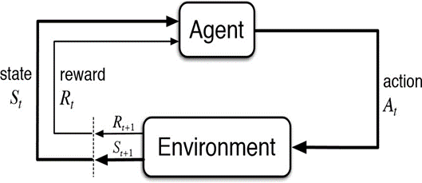

# Traffic Signal Control using Reinforcement Learning

## Overview

This project focuses on optimizing traffic signal control at a single intersection using Reinforcement Learning (RL) techniques. The traffic environment is simulated using the SUMO (Simulation of Urban MObility) framework. The RL agent learns to adjust traffic signal phases based on past experiences to minimize congestion and enhance traffic flow.

## Project Structure

### 1. Traffic Simulation Setup

- The SUMO framework is utilized for traffic simulation.
- Simulation takes place at a single intersection with four lanes.

### 2. Neural Network Model (Q-Network)

- The Q-network, implemented as a Convolutional Neural Network (CNN), serves as the core of the RL approach.
- The Q-network takes the current state of the traffic environment as input and outputs Q-values for different actions (traffic light phase changes).

### 3. State Representation

- The state is represented by a combination of traffic counts in different regions and the current phase of the traffic light.

### 4. Actions and Rewards

- Actions correspond to changing the traffic light phase.
- Rewards are calculated based on the difference in queue lengths between consecutive states.
- Absolute reward is calculated as the cubic difference in queue lengths.

### 5. Experience Replay

- Experience replay is employed, storing past experiences (state, action, reward, next state) in a replay memory.
- Random samples from the memory are used for training the Q-network, improving stability and efficiency.

### 6. Exploration-Exploitation

- Epsilon-greedy strategy is used for exploration-exploitation, balancing exploration with exploitation based on a certain probability (epsilon).

### 7. Target Network

- A target Q-network is used to stabilize training. The target network is periodically updated with the weights of the main Q-network.

### 8. Training Loop

- The RL agent undergoes episodes of simulation, exploring the traffic environment and learning from experiences.
- At each time step, the agent selects an action, observes the new state and reward, and updates the Q-network.

### 9. Visualization and Analysis

- Visualization elements include plotting average Q-values per episode.
- Metrics such as delay times, waiting times, and others are collected for analysis.

### 10. Model Saving

- Trained Q-network models are saved after each episode for later analysis or deployment.

## Running the Code

1. Set up the SUMO environment.
2. Initialize the Q-network and target Q-network.
3. Populate the replay memory with random actions.
4. Execute the main training loop consisting of multiple episodes.

## Explanation Tips

- The project aims to optimize traffic flow at a single intersection.
- RL is employed to learn the best traffic signal control strategy over time.
- The Q-network learns to estimate the value of different actions in different traffic scenarios.

## Improvements

- The code structure and explanations could be further improved for clarity.
- Detailed comments within the code could enhance readability.
- Additional documentation on specific choices made in the RL algorithm and network architecture would be beneficial.

## Author

Raghu Dungala
